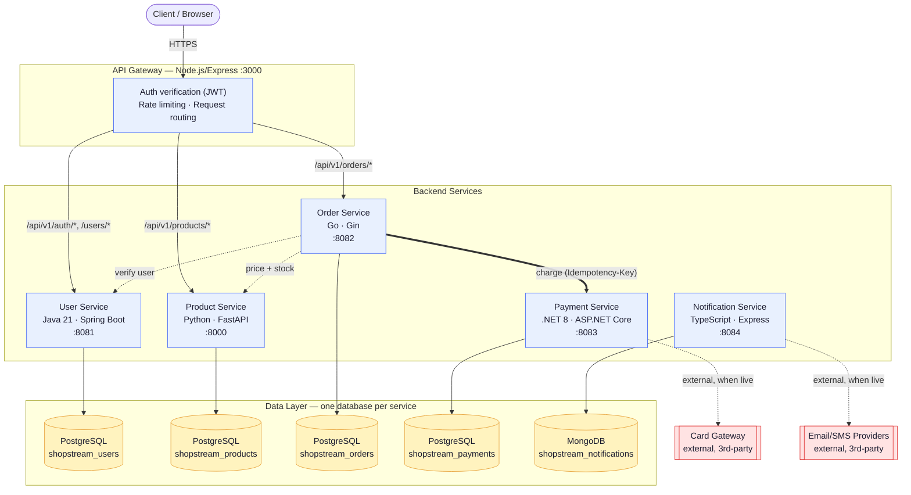

# ShopStream — Microservices Platform

ShopStream is a small e-commerce platform built as a realistic,
polyglot microservices system: 6 independently buildable/testable/
deployable services across 5 languages, each owning its own database,
talking to each other over REST, with health/readiness checks,
structured logging, retries/timeouts, and graceful shutdown baked in from
the start.

This repository is the **developer/application handoff** to a
DevOps/platform engineering team. It intentionally contains **no**
Dockerfiles, CI/CD pipelines, Kubernetes manifests, Helm charts, Terraform,
Ansible, Argo CD config, or observability stack config — those are the
DevOps team's own build, so they can be practiced from scratch. See
[What this repo does *not* contain](#what-this-repo-does-not-contain).

## Architecture



Each service **owns its own database exclusively** — no service ever
queries another service's database directly. Cross-service data (e.g.
order-service needing a product's price) is fetched over HTTP at request
time, through resilient clients with timeouts and bounded retries.

notification-service is not yet wired into the order/payment flow by the
other services in this build (see its README) — its API, schema, and
provider integration are complete and independently testable, but nothing
currently calls it automatically. That's a reasonable first integration
task once the platform is deployed.

## Services

| Service | Language | Framework | Port | Database | README |
|---|---|---|---|---|---|
| API Gateway | Node.js | Express | 3000 | — (stateless) | [api-gateway/README.md](api-gateway/README.md) |
| User Service | Java 21 | Spring Boot 3.3 | 8081 | PostgreSQL | [user-service/README.md](user-service/README.md) |
| Product Service | Python 3.12 | FastAPI | 8000 | PostgreSQL | [product-service/README.md](product-service/README.md) |
| Order Service | Go | Gin | 8082 | PostgreSQL | [order-service/README.md](order-service/README.md) |
| Payment Service | C# / .NET 8 | ASP.NET Core | 8083 | PostgreSQL | [payment-service/README.md](payment-service/README.md) |
| Notification Service | TypeScript | Express | 8084 | MongoDB | [notification-service/README.md](notification-service/README.md) |

Every service README documents: language/framework/runtime version, build
tool, exact build/test/run commands, port, environment variables,
dependencies, database requirements, API endpoints, health/readiness
endpoints, and service-to-service dependencies — everything needed to
write its Dockerfile and Jenkins stage without reading the source.

> **Cross-service config gotcha**: api-gateway and user-service's
> `JWT_SECRET` must be set to the **identical value** — user-service issues
> tokens, the gateway only verifies them. A mismatch doesn't fail startup
> on either side; it silently fails every authenticated request at runtime
> with `401 invalid_token`. Worth a shared secret (or Kubernetes Secret)
> rather than two independently-generated values per environment.

## Repository structure

```text
microservices-platform/
├── api-gateway/            Node.js / Express
├── user-service/           Java 21 / Spring Boot / Maven
├── product-service/        Python / FastAPI / pip
├── order-service/          Go / Gin
├── payment-service/        C# / ASP.NET Core / .NET 8
├── notification-service/   TypeScript / Express
├── docs/
│   └── FAILURE_SCENARIOS.md   Cross-service incident-practice catalog
└── README.md                  This file
```

Each service directory is self-contained: its own dependency manifest
(`package.json` / `pom.xml` / `requirements.txt` / `go.mod` / `.csproj`),
its own tests, its own `.env.example`, its own README. None of them import
from or depend on another service's source tree.

## Local development (without Docker)

Each service can run standalone against its own local database. General
pattern, repeated per service in its README:

```bash
cd <service>
cp .env.example .env    # fill in DB credentials / secrets
# install deps, per that service's README
# run its migration/seed scripts
# start it
```

Ports are pre-assigned (see table above) so all 6 can run side by side.
`API_GATEWAY`'s `.env.example` already points at the other 5 services'
default ports.

## What every service was built with in common

- **Health vs. readiness split**: `/health` (or `/actuator/health`) is
  liveness-only and never checks dependencies; `/ready` (or
  `/actuator/health/readiness`) checks the database and, for the gateway,
  every downstream service. This mirrors what a Kubernetes liveness vs.
  readiness probe actually needs.
- **Structured (JSON) logging** with a propagated `X-Request-Id`, so one
  request can be traced across service logs.
- **Timeouts + bounded exponential-backoff retries** on every
  service-to-service HTTP call, distinguishing "downstream unreachable"
  from "downstream timed out" from "downstream returned an error."
- **Graceful shutdown**: every service stops accepting new connections and
  drains in-flight requests on SIGTERM before exiting.
- **Config via environment variables only**, documented with
  `.env.example` files, no secrets committed.
- **Each service owns its schema** and ships its own migrations/seed data
  so local dev and CI can stand it up from scratch.

## What this repo does *not* contain

By design — these are the platform/DevOps team's deliverables, not the
application team's:

- Dockerfiles (each service's README gives you everything needed to write
  one: runtime version, build command, start command, port, dependencies)
- Jenkinsfile / GitHub Actions / GitLab CI / any CI config
- Kubernetes manifests, Helm charts
- Terraform, Ansible, Argo CD config
- AWS infrastructure code
- Prometheus/Grafana config

## Failure scenarios

See [docs/FAILURE_SCENARIOS.md](docs/FAILURE_SCENARIOS.md) for the full
catalog of production incidents this platform is deliberately built to let
you reproduce — database outages, downstream timeouts, bad config, broken
health checks, and more — mapped to exactly which service, which env var,
and which expected symptom.

## Suggested next steps for the DevOps handoff

```text
Source Code (this repo)
    ↓
Dockerization           — one Dockerfile per service (5 different bases)
    ↓
Jenkins CI/CD           — detect changed service → build → test → scan → push
    ↓
SonarQube / Trivy       — static analysis + image scanning
    ↓
Amazon ECR              — 6 image repositories
    ↓
Terraform → AWS → EKS   — cluster + networking + managed Postgres/Mongo
    ↓
Kubernetes / Helm       — one chart per service, or an umbrella chart
    ↓
Argo CD                 — GitOps delivery
    ↓
Prometheus / Grafana    — metrics, dashboards, alerting
    ↓
Production Monitoring & Incident Response
```
